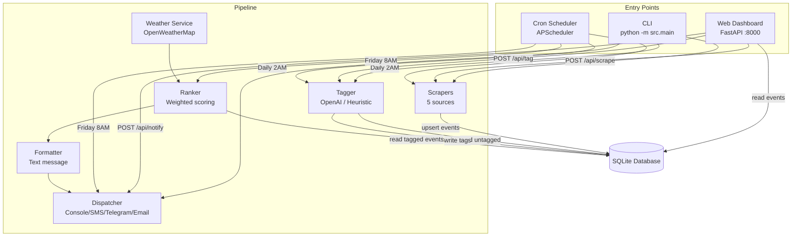
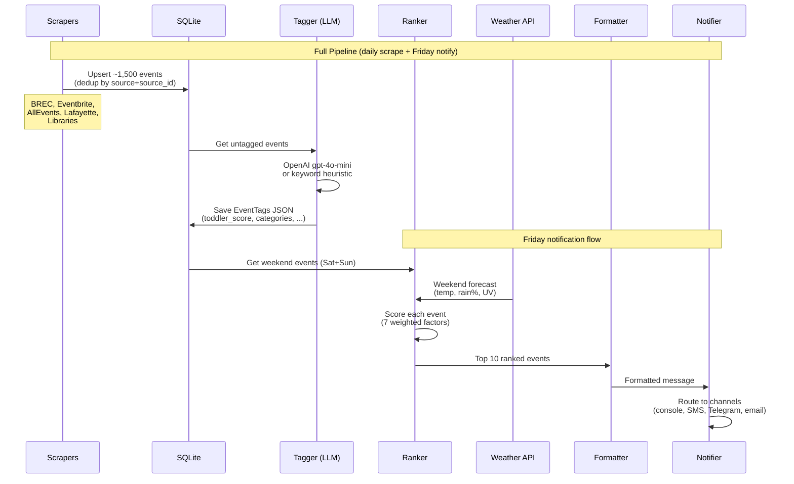
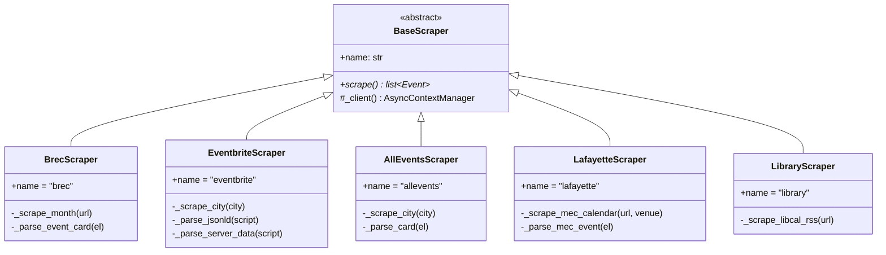
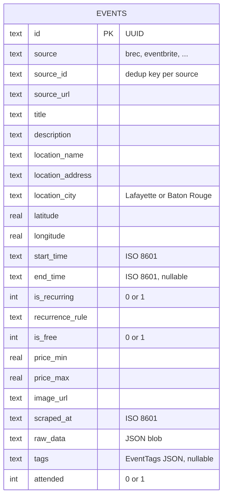
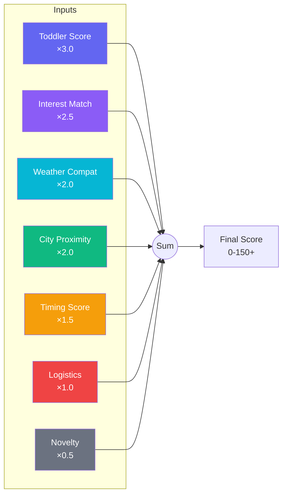
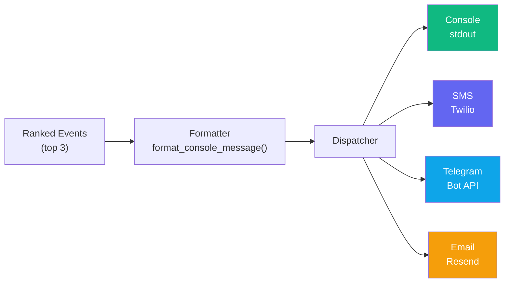
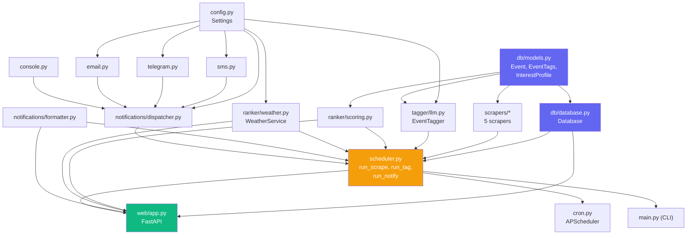

# Architecture & Data Flow

## System Overview

The system has two entry points: a **web dashboard** (FastAPI) and a **cron scheduler**
(APScheduler). Both share the same pipeline modules and SQLite database.




## Data Pipeline Flow

The full pipeline runs as: **Scrape → Tag → Rank → Notify**.
Each step can also be triggered independently.




## Scraper Architecture

All scrapers inherit from `BaseScraper` and implement `async scrape() -> list[Event]`.
Each scraper handles its own HTML parsing, deduplication key generation, and error recovery.




## Database Schema

Single table design. Events are uniquely identified by `(source, source_id)`.
Tags are stored as a JSON blob in the `tags` column.




### EventTags JSON Structure

```json
{
  "toddler_score": 8,
  "age_min_recommended": 0,
  "age_max_recommended": 99,
  "indoor_outdoor": "outdoor",
  "noise_level": "moderate",
  "crowd_level": "medium",
  "energy_level": "active",
  "stroller_friendly": true,
  "parking_available": true,
  "bathroom_accessible": true,
  "food_available": false,
  "nap_compatible": true,
  "weather_dependent": true,
  "good_for_rain": false,
  "good_for_heat": false,
  "categories": ["animals", "nature", "arts"],
  "confidence_score": 0.5,
  "parent_attention_required": "partial",
  "meltdown_risk": "low"
}
```

## Scoring Breakdown

The ranker computes a weighted score for each tagged event. Higher is better.




| Factor         | Weight | Source          | How It Works                                                  |
| -------------- | ------ | --------------- | ------------------------------------------------------------- |
| Toddler Score  | ×3.0   | AI tags         | LLM rates 0-10 how appropriate for a 3-year-old               |
| Interest Match | ×2.5   | Tags + Profile  | Compares event categories against loves/likes/dislikes        |
| Weather Compat | ×2.0   | Tags + Forecast | Rain→indoor bonus, heat→shade bonus, outdoor→clear bonus      |
| City Proximity | ×2.0   | Event location  | Lafayette=+10, Baton Rouge=+2, other=-5                       |
| Timing         | ×1.5   | Event time      | Morning bonus, nap time (1-3pm) penalty, post-bedtime penalty |
| Logistics      | ×1.0   | AI tags         | Stroller-friendly, parking, bathrooms, low meltdown risk      |
| Novelty        | ×0.5   | Attended flag   | Not recently attended gets a bonus                            |


## Notification Flow




The formatter produces a plain-text message like:

```
🌟 Weekend Plans for Your Little One! 🌟

Weather: ⛅ Sat 85°F / 🌤️ Sun 87°F

🥇 TOP PICK: Lafayette Farmers & Artisans Market
   📍 Lafayette | 🕐 Sat 12:00pm | 💵 Free
   ✨ animals, arts, outdoor, stroller-friendly

🥈: Movies at Moncus - Zootopia
   ...
```

## Module Dependency Graph




## File Structure

```
family-events/
├── pyproject.toml              # Dependencies, ruff + ty config
├── .env / .env.example         # API keys
├── family_events.db            # SQLite database (auto-created)
├── family-events.service       # systemd: web server
├── family-events-cron.service  # systemd: scheduler
├── src/
│   ├── config.py               # Settings from .env
│   ├── main.py                 # CLI (scrape/tag/notify/serve/events)
│   ├── scheduler.py            # Pipeline orchestrator
│   ├── cron.py                 # APScheduler daemon
│   ├── db/
│   │   ├── models.py           # Event, EventTags, InterestProfile
│   │   └── database.py         # Async SQLite (upsert, search, filter)
│   ├── scrapers/
│   │   ├── base.py             # BaseScraper ABC
│   │   ├── brec.py             # BREC parks
│   │   ├── eventbrite.py       # Eventbrite
│   │   ├── allevents.py        # AllEvents.in
│   │   ├── lafayette.py        # Moncus, Arts, Science Museum
│   │   └── library.py          # Library calendars
│   ├── tagger/
│   │   └── llm.py              # OpenAI + heuristic fallback
│   ├── ranker/
│   │   ├── scoring.py          # Multi-factor weighted scoring
│   │   └── weather.py          # OpenWeatherMap forecasts
│   ├── notifications/
│   │   ├── formatter.py        # Text message formatting
│   │   ├── dispatcher.py       # Channel routing
│   │   ├── console.py          # stdout
│   │   ├── sms.py              # Twilio
│   │   ├── telegram.py         # Telegram Bot
│   │   └── email.py            # Resend
│   └── web/
│       ├── app.py              # FastAPI routes (221 lines)
│       └── templates/          # 14 Jinja2 templates
└── docs/
    ├── architecture.md         # This file
    ├── frontend.md             # HTMX + template docs
    └── pipeline.md             # Scraping + tagging pipeline
```

