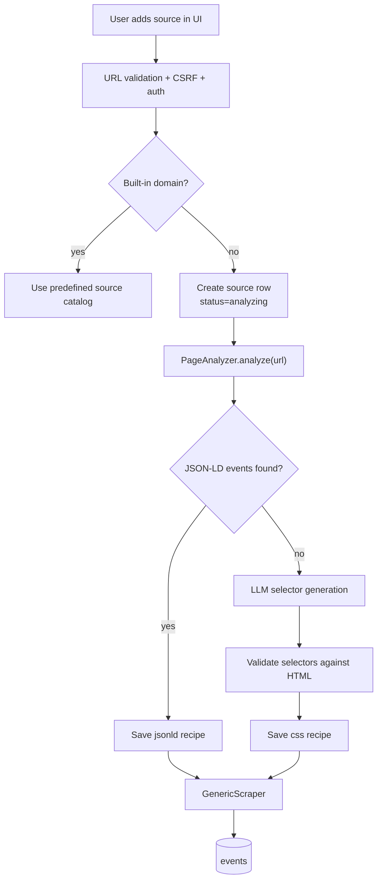

# Design: Generic Scraper with Smart Routing

This document describes the feature as it exists now, not as a greenfield plan.

## Goal

Allow users to add arbitrary public event URLs through the web UI. The system:

1. detects whether the URL belongs to a built-in supported domain
2. otherwise analyzes the page
3. stores a reusable `ScrapeRecipe`
4. replays that recipe during future scrapes

## Current architecture

```mermaid
flowchart TD
    USER["User adds source in UI"] --> VALIDATE["URL validation + CSRF + auth"]
    VALIDATE --> BUILTIN{"Built-in domain?"}
    BUILTIN -->|yes| CATALOG["Use predefined source catalog"]
    BUILTIN -->|no| CREATE["Create source row\nstatus=analyzing"]
    CREATE --> ANALYZE["PageAnalyzer.analyze(url)"]
    ANALYZE --> JSONLD{"JSON-LD events found?"}
    JSONLD -->|yes| SAVEJSON["Save jsonld recipe"]
    JSONLD -->|no| LLM["LLM selector generation"]
    LLM --> VALID["Validate selectors against HTML"]
    VALID --> SAVE["Save css recipe"]
    SAVEJSON --> REPLAY["GenericScraper"]
    SAVE --> REPLAY
    REPLAY --> EVENTS[(events)]
```

## Built-in routing

Implemented in `src/scrapers/router.py`.

Important functions:

- `extract_domain(url)`
- `is_builtin_domain(url)`
- `get_builtin_scraper(source)`

Current built-in domains:

- `brec.org`
- `eventbrite.com`
- `allevents.in`
- `moncuspark.org`
- `acadianacenterforthearts.org`
- `lafayettesciencemuseum.org`
- `lafayettela.libcal.com`
- `ebrpl.libcal.com`

If a user submits a custom URL that matches a built-in domain, the UI returns an
informational message directing them to the predefined source catalog.

## Source model

The real `Source` model includes more than the original design draft:

- `id`
- `name`
- `url`
- `domain`
- `city`
- `category`
- `user_id`
- `builtin`
- `recipe_json`
- `enabled`
- `status`
- `last_scraped_at`
- `last_event_count`
- `last_error`
- `created_at`
- `updated_at`

In Postgres, sources live in a dedicated table with:

- UUID primary key
- FK to `users.id` with cascade delete
- status check constraint
- `url` uniqueness

## Recipe model

Implemented in `src/scrapers/recipe.py`.

Supported strategies today:

- `css`
- `jsonld`

Main models:

- `FieldRule`
- `Pagination`
- `CSSFields`
- `CSSStrategy`
- `JSONLDStrategy`
- `ScrapeRecipe`

Note that `start_time` in `CSSFields` is currently optional at the model level,
though a useful recipe effectively needs it.

## Analyzer

Implemented in `src/scrapers/analyzer.py` as `PageAnalyzer`.

### Fetch safety

The analyzer now includes SSRF-oriented protections:

- only `http` / `https`
- reject private/local/loopback/link-local/reserved IPs
- validate DNS-resolved addresses before outbound requests
- validate redirect destinations as well

### Analysis flow

1. fetch page HTML
2. parse with BeautifulSoup
3. check for JSON-LD events first
4. otherwise clean HTML
5. ask OpenAI for a selector recipe
6. validate recipe against the fetched HTML

Clean-up removes noise such as:

- scripts/styles/nav/footer
- forms/buttons/inputs
- cookie/banner/modal-like sections
- comments

## Generic scraper replay

Implemented in `src/scrapers/generic.py`.

### JSON-LD mode

- scans `application/ld+json` scripts
- extracts `@type == Event`
- maps into internal `Event` models

### CSS mode

- fetches page
- selects each `event_container`
- extracts configured fields
- supports pagination via `next_selector`
- normalizes relative URLs with `urljoin`

Custom source events are written with source names like:

- `custom:{source_id}`

## Web flows

Implemented in `src/web/routes/sources.py`.

Main UI flows:

- `GET /sources`
- `GET /source/{source_id}`
- `POST /api/sources`
- `POST /api/sources/{source_id}/analyze`
- `POST /api/sources/{source_id}/test`
- `POST /api/sources/{source_id}/toggle`
- `DELETE /api/sources/{source_id}`
- `POST /api/sources/predefined`

These are authenticated, CSRF-protected flows and often run through the job system.

## Predefined source catalog

The predefined catalog lives in `src/predefined_sources.py`.

It includes current family-event oriented sources across cities such as:

- Baton Rouge
- Lafayette
- New Orleans
- Houston
- Austin
- Dallas
- Atlanta

For local onboarding, Baton Rouge and Lafayette are the primary intended cities.

## Practical limitations

- Generic scraping still depends heavily on page structure stability.
- Some event sites are JS-heavy and may still need a browser-based approach later.
- Recipe confidence can be low; the UI surfaces test/reanalyze flows for that reason.
- Search and recommendation quality for custom-source events still benefits from manual smoke testing.
