# Design: Generic Scraper with Smart Routing

## Goal

Allow users to add any event website URL through the web UI. The system
automatically figures out how to scrape it, generates a reusable extraction
recipe, and includes it in the regular scraping schedule.

Built-in scrapers handle known sites. Unknown sites get an LLM-generated recipe.

## Architecture


## Source Router

The router maps URL domains to scraper implementations. It lives in
`src/scrapers/router.py` and is the single entry point for all scraping.

```python
# src/scrapers/router.py

# Domain → built-in scraper class
BUILTIN_DOMAINS: dict[str, type[BaseScraper]] = {
    "brec.org": BrecScraper,
    "eventbrite.com": EventbriteScraper,
    "allevents.in": AllEventsScraper,
    "moncuspark.org": LafayetteScraper,
    "acadianacenterforthearts.org": LafayetteScraper,
    "lafayettesciencemuseum.org": LafayetteScraper,
    "lafayettela.libcal.com": LibraryScraper,
    "ebrpl.libcal.com": LibraryScraper,
}

def get_scraper_for_url(url: str, recipe: ScrapeRecipe | None = None) -> BaseScraper:
    domain = extract_domain(url)  # "www.brec.org" → "brec.org"
    if domain in BUILTIN_DOMAINS:
        return BUILTIN_DOMAINS[domain]()
    return GenericScraper(url=url, recipe=recipe)
```

When a user adds a URL:
1. Router checks domain against `BUILTIN_DOMAINS`
2. **Match?** → Show "We have built-in support for this site!" and use the built-in scraper
3. **No match?** → Create a new source entry, run the LLM analyzer to generate a recipe

## Database: `sources` Table

New table for user-defined scraping sources.

```sql
CREATE TABLE IF NOT EXISTS sources (
    id          TEXT PRIMARY KEY,     -- UUID
    name        TEXT NOT NULL,        -- User-friendly name ("Downtown Events Calendar")
    url         TEXT NOT NULL UNIQUE, -- URL to scrape
    domain      TEXT NOT NULL,        -- Extracted domain for routing
    builtin     INTEGER NOT NULL DEFAULT 0,  -- 1 if matched to built-in scraper
    recipe      TEXT,                 -- JSON ScrapeRecipe (null for built-in)
    enabled     INTEGER NOT NULL DEFAULT 1,
    last_scraped_at TEXT,             -- ISO timestamp
    last_event_count INTEGER DEFAULT 0,
    last_error  TEXT,                 -- Last scrape error message (null if OK)
    created_at  TEXT NOT NULL,
    updated_at  TEXT NOT NULL
);
```

Built-in scrapers are **not** stored in this table by default — they run
automatically. The table is only for user-added sources. If a user adds a
URL that matches a built-in domain, we set `builtin=1` and `recipe=NULL`.

## Scrape Recipe Format

The recipe is a JSON blob that tells `GenericScraper` how to extract events
from a specific page without calling the LLM again.


### Example Recipe: CSS Strategy

```json
{
  "version": 1,
  "strategy": "css",
  "analyzed_at": "2025-02-24T04:30:00Z",
  "confidence": 0.85,
  "notes": "Community center events page with card layout",
  "css": {
    "event_container": "div.event-card",
    "fields": {
      "title": {
        "selector": "h3.event-title",
        "attr": null
      },
      "description": {
        "selector": ".event-description",
        "attr": null
      },
      "start_time": {
        "selector": "time.start",
        "attr": "datetime",
        "format": "iso"
      },
      "end_time": {
        "selector": "time.end",
        "attr": "datetime",
        "format": "iso"
      },
      "location": {
        "selector": ".venue-name",
        "attr": null
      },
      "url": {
        "selector": "a.event-link",
        "attr": "href"
      },
      "price": {
        "selector": ".ticket-price",
        "attr": null,
        "default": "Free"
      },
      "image": {
        "selector": "img.event-thumb",
        "attr": "src"
      }
    },
    "pagination": {
      "next_selector": "a.next-page",
      "max_pages": 3
    }
  }
}
```

### Example Recipe: JSON-LD Strategy

Many modern event sites embed structured data. This is the simplest recipe.

```json
{
  "version": 1,
  "strategy": "jsonld",
  "analyzed_at": "2025-02-24T04:30:00Z",
  "confidence": 0.95,
  "notes": "Site uses schema.org Event JSON-LD in script tags",
  "jsonld": {
    "event_type": "Event"
  }
}
```

## LLM Analyzer

The analyzer runs once per URL to generate the recipe. It sends cleaned HTML
to the LLM and gets back the recipe JSON.


### HTML Cleaning

Raw HTML is too large for LLM context. The cleaner:

1. Parse with BeautifulSoup
2. Remove: `<script>`, `<style>`, `<nav>`, `<footer>`, `<header>`, `<iframe>`, comments
3. Remove elements with common ad/cookie classes: `.cookie-banner`, `.advertisement`, etc.
4. Keep: `<main>` content, or `<body>` if no `<main>`
5. Simplify: collapse whitespace, remove empty tags, limit depth
6. Truncate to ~6,000 tokens (~24KB of clean HTML)
7. Add a hint: include first 5 `<a>` href patterns to help LLM understand link structure

### LLM Prompt for Recipe Generation

```
You are an expert web scraper. Analyze this HTML from an events page and
return a JSON scraping recipe.

The page URL is: {url}

Find the CSS selectors for:
1. The container element that wraps each individual event
2. Within each container, the selectors for:
   - title (text content)
   - description (text content, may be truncated)
   - start date/time (prefer datetime attr on <time>, else text)
   - end date/time (if available)
   - location/venue name
   - link to event detail page (href)
   - price (text, "Free" if not shown)
   - image (src)
3. Pagination: selector for "next page" link, if any

Return ONLY this JSON structure:
{recipe_schema}

IMPORTANT:
- Use specific CSS selectors (class names, tag+class combos)
- If a field isn't present in the HTML, set selector to null
- For dates: note the format ("iso" if datetime attr, "human" if text like "Sat, Mar 8")
- Set confidence 0-1 based on how clear the page structure is

HTML:
{cleaned_html}
```

### Recipe Validation

After the LLM generates a recipe, validate it before saving:

1. Parse the original HTML with BeautifulSoup
2. Apply `event_container` selector → must find ≥1 element
3. For each found container, apply field selectors → `title` must be non-empty
4. Try parsing at least one `start_time` value with the specified format
5. If validation fails: retry LLM with feedback ("selector '.event-card' found 0 elements")
6. After 2 failed retries: save with low confidence, flag for manual review

## Generic Scraper

The `GenericScraper` has two modes: **replay** (use recipe) and **analyze** (generate recipe).

```python
# src/scrapers/generic.py

class GenericScraper(BaseScraper):
    source_name = "custom"

    def __init__(self, url: str, source_id: str, recipe: ScrapeRecipe | None = None):
        self.url = url
        self.source_id = source_id
        self.recipe = recipe

    async def scrape(self) -> list[Event]:
        if self.recipe is None:
            raise ValueError("No recipe. Run analyze() first.")

        if self.recipe.strategy == "jsonld":
            return await self._scrape_jsonld()
        elif self.recipe.strategy == "css":
            return await self._scrape_css()
        else:
            raise ValueError(f"Unknown strategy: {self.recipe.strategy}")

    async def _scrape_jsonld(self) -> list[Event]:
        """Extract events from JSON-LD script tags."""
        html = await self._fetch()
        soup = BeautifulSoup(html, "html.parser")
        events = []
        for script in soup.find_all("script", type="application/ld+json"):
            data = json.loads(script.string)
            # Handle single event or array
            items = data if isinstance(data, list) else [data]
            for item in items:
                if item.get("@type") == "Event":
                    events.append(self._jsonld_to_event(item))
        return events

    async def _scrape_css(self) -> list[Event]:
        """Extract events using CSS selectors from recipe."""
        all_events = []
        url = self.url
        pages = 0

        while url and pages < self.recipe.css.pagination.max_pages:
            html = await self._fetch(url)
            soup = BeautifulSoup(html, "html.parser")
            containers = soup.select(self.recipe.css.event_container)

            for el in containers:
                event = self._extract_from_container(el)
                if event:
                    all_events.append(event)

            # Pagination
            next_sel = self.recipe.css.pagination.next_selector
            if next_sel:
                next_link = soup.select_one(next_sel)
                url = urljoin(self.url, next_link["href"]) if next_link else None
            else:
                url = None
            pages += 1

        return all_events

    def _extract_from_container(self, el: Tag) -> Event | None:
        """Apply field rules to a single event container element."""
        fields = self.recipe.css.fields
        title = self._extract_field(el, fields.title)
        if not title:
            return None

        return Event(
            source=f"custom:{self.source_id}",
            source_url=self._extract_field(el, fields.url) or self.url,
            source_id=slugify(title + self._extract_field(el, fields.start_time, "")),
            title=title,
            description=self._extract_field(el, fields.description) or "",
            start_time=self._parse_datetime(self._extract_field(el, fields.start_time)),
            ...
        )

    def _extract_field(self, el: Tag, rule: FieldRule | None, default="") -> str:
        if not rule or not rule.selector:
            return default
        found = el.select_one(rule.selector)
        if not found:
            return rule.default or default
        if rule.attr:
            return found.get(rule.attr, default)
        return found.get_text(strip=True)
```

## Recipe Lifecycle


| State | Meaning | Action |
|-------|---------|--------|
| **Pending** | URL added, no recipe yet | Auto-trigger analysis |
| **Analyzing** | LLM is generating a recipe | Show spinner in UI |
| **Active** | Recipe works, scraping on schedule | Show ✅ in UI |
| **Stale** | Recipe returned 0 events | Auto re-analyze, show ⚠️ |
| **Failed** | LLM couldn't extract events | Show ❌, offer retry |
| **Disabled** | User turned off this source | Skip in cron |

## Scheduler Changes

```python
# src/scheduler.py — updated run_scrape()

async def run_scrape(db: Database) -> int:
    total = 0

    # 1. Run built-in scrapers (unchanged)
    for scraper in BUILTIN_SCRAPERS:
        events = await scraper.scrape()
        for event in events:
            await db.upsert_event(event)
        total += len(events)

    # 2. Run user-defined sources
    sources = await db.get_enabled_sources(builtin=False)
    for source in sources:
        try:
            if source.recipe is None:
                continue  # skip pending/failed sources
            scraper = GenericScraper(
                url=source.url,
                source_id=source.id,
                recipe=ScrapeRecipe.model_validate_json(source.recipe),
            )
            events = await scraper.scrape()
            for event in events:
                await db.upsert_event(event)
            await db.update_source_status(source.id, count=len(events))
            total += len(events)
        except Exception as e:
            await db.update_source_status(source.id, error=str(e))

    return total
```

## Web UI: Sources Page

### Pages

| Route | Description |
|-------|-------------|
| `GET /sources` | List all user-defined sources with status badges |
| `GET /sources/add` | Add source form (URL input) |
| `POST /api/sources` | Create source, trigger analysis |
| `GET /source/{id}` | Source detail: recipe, last scrape, events preview |
| `POST /api/sources/{id}/analyze` | Re-analyze (regenerate recipe) |
| `POST /api/sources/{id}/test` | Test scrape (dry run, show extracted events) |
| `POST /api/sources/{id}/toggle` | Enable/disable |
| `DELETE /api/sources/{id}` | Delete source and its events |

### Add Source Flow

```mermaid
sequenceDiagram
    participant U as User
    participant UI as Browser
    participant S as Server
    participant LLM as OpenAI

    U->>UI: Pastes URL, clicks "Add Source"
    UI->>S: POST /api/sources {url: "..."}

    S->>S: Extract domain from URL
    alt Domain matches built-in
        S-->>UI: "✅ We have built-in support for this site!<br/>It's already being scraped."
    else Unknown domain
        S->>S: Create source (status: analyzing)
        S-->>UI: "🔄 Analyzing page structure..."
        S->>S: Fetch HTML
        S->>S: Check for JSON-LD
        alt Has JSON-LD
            S->>S: Save recipe (jsonld strategy)
        else No JSON-LD
            S->>LLM: "Generate scraping recipe"
            LLM-->>S: Recipe JSON
            S->>S: Validate selectors against HTML
            S->>S: Save recipe
        end
        S->>S: Test scrape with recipe
        S-->>UI: "✅ Found 12 events!" + preview table
    end
```



### Sources List UI Mockup

```
📡 Event Sources (3 custom + 5 built-in)

┌─────────────────────────────────────────────────────────┐
│ ✅ Downtown Lafayette Events Calendar                    │
│    https://downtownlafayette.org/events                 │
│    Strategy: CSS selectors · 18 events · Last: 2h ago   │
│    [Test] [Disable] [Delete]                            │
├─────────────────────────────────────────────────────────┤
│ ✅ Cajun Food Festivals                                  │
│    https://cajunfoodfest.com/upcoming                   │
│    Strategy: JSON-LD · 4 events · Last: 2h ago          │
│    [Test] [Disable] [Delete]                            │
├─────────────────────────────────────────────────────────┤
│ ⚠️ Lake Charles Events (stale)                           │
│    https://lakecharlescvb.com/events                    │
│    0 events found · Recipe may be outdated              │
│    [Re-analyze] [Disable] [Delete]                      │
├─────────────────────────────────────────────────────────┤
│ 🔧 Built-in: BREC Parks · 1,361 events                  │
│ 🔧 Built-in: Eventbrite · 48 events                     │
│ 🔧 Built-in: AllEvents · 31 events                      │
│ 🔧 Built-in: Lafayette Venues · 55 events               │
│ 🔧 Built-in: Libraries · pending                        │
└─────────────────────────────────────────────────────────┘

[+ Add Source]
```

## Templates

```
src/web/templates/
  sources.html                  # Sources list page
  source_detail.html            # Single source: recipe, events, controls
  partials/
    _source_row.html            # Source card in list
    _source_form.html           # Add source form (URL input)
    _recipe_preview.html        # Recipe details display
    _source_test_results.html   # Test scrape results (HTMX partial)
```

## New Files

```
src/
  scrapers/
    router.py          # BUILTIN_DOMAINS map, get_scraper_for_url()
    generic.py         # GenericScraper (CSS + JSON-LD replay)
    analyzer.py        # LLM recipe generator + validator
    recipe.py          # ScrapeRecipe, FieldRule, CSSStrategy Pydantic models
  db/
    database.py        # +sources CRUD methods
    models.py          # +Source model, +ScrapeRecipe model
  web/
    app.py             # +source routes
    templates/
      sources.html
      source_detail.html
      partials/_source_*.html
```

## Pydantic Models

```python
# src/scrapers/recipe.py

class FieldRule(BaseModel):
    selector: str | None = None   # CSS selector (null = field not available)
    attr: str | None = None       # HTML attribute (null = textContent)
    format: str = "human"         # "iso", "human", or regex pattern
    default: str = ""             # fallback value

class Pagination(BaseModel):
    next_selector: str | None = None
    max_pages: int = 3

class CSSFields(BaseModel):
    title: FieldRule
    description: FieldRule | None = None
    start_time: FieldRule
    end_time: FieldRule | None = None
    location: FieldRule | None = None
    url: FieldRule | None = None
    price: FieldRule | None = None
    image: FieldRule | None = None

class CSSStrategy(BaseModel):
    event_container: str          # CSS selector for each event wrapper
    fields: CSSFields
    pagination: Pagination = Pagination()

class JSONLDStrategy(BaseModel):
    event_type: str = "Event"     # schema.org type

class ScrapeRecipe(BaseModel):
    version: int = 1
    strategy: Literal["css", "jsonld"]
    analyzed_at: datetime
    confidence: float = 0.0
    notes: str = ""
    css: CSSStrategy | None = None
    jsonld: JSONLDStrategy | None = None


# src/db/models.py

class Source(BaseModel):
    id: str
    name: str
    url: str
    domain: str
    builtin: bool = False
    recipe: ScrapeRecipe | None = None
    enabled: bool = True
    status: Literal["pending", "analyzing", "active", "stale", "failed", "disabled"]
    last_scraped_at: datetime | None = None
    last_event_count: int = 0
    last_error: str | None = None
    created_at: datetime
    updated_at: datetime
```

## Implementation Order

### Phase 1: Foundation (Day 1)
1. `recipe.py` — Pydantic models for `ScrapeRecipe`, `FieldRule`, `CSSStrategy`, `JSONLDStrategy`
2. `Source` model in `models.py`
3. `sources` table creation + CRUD methods in `database.py`
4. `router.py` — `BUILTIN_DOMAINS` map, `get_scraper_for_url()`, `extract_domain()`

### Phase 2: Generic Scraper (Day 1-2)
5. `generic.py` — `GenericScraper` with `_scrape_jsonld()` and `_scrape_css()` replay
6. `analyzer.py` — HTML cleaner, LLM prompt, recipe validation
7. Test with a known events page to verify recipe generation + replay

### Phase 3: Scheduler Integration (Day 2)
8. Update `run_scrape()` in `scheduler.py` to include user sources
9. Add stale detection: if recipe returns 0 events, mark stale + re-analyze
10. Add source status tracking on scrape success/failure

### Phase 4: Web UI (Day 2-3)
11. `GET /sources` — list all sources with status badges
12. `POST /api/sources` — add source (URL input), trigger analysis
13. `GET /source/{id}` — source detail with recipe, last scrape, events
14. `POST /api/sources/{id}/test` — dry-run scrape, return events preview
15. `POST /api/sources/{id}/analyze` — regenerate recipe
16. `POST /api/sources/{id}/toggle` — enable/disable
17. `DELETE /api/sources/{id}` — delete source + its events
18. Add "Sources" nav link to `base.html`

### Phase 5: Polish (Day 3)
19. Show built-in sources on the sources page (read-only, with event counts)
20. Handle edge cases: redirects, auth-walled pages, JavaScript-only sites
21. Add recipe confidence display and "re-analyze" button for low-confidence recipes
22. Update docs

## Edge Cases

| Case | Handling |
|------|----------|
| URL is a built-in domain | Show message, don't create duplicate source |
| Page requires JavaScript | Detect (empty body after fetch), show "needs Playwright" warning |
| Page is behind auth/login | Detect 401/403, show error |
| Page has no events | LLM returns confidence < 0.3, mark as failed |
| Site changes structure | Recipe returns 0 events → auto re-analyze |
| User adds same URL twice | `UNIQUE(url)` constraint prevents duplicates |
| LLM hallucinates selectors | Validation catches it (selector finds 0 elements) |
| Very large page (>200KB) | HTML cleaner truncates to ~6K tokens |
| Pagination across pages | Follow `next_selector` up to `max_pages` |
| Relative URLs in events | `urljoin(base_url, href)` |
| Dates in weird formats | LLM specifies format in recipe; parser handles common patterns |

## Cost Estimate

| Action | Cost | Frequency |
|--------|------|-----------|
| Analyze new URL | ~$0.01-0.02 | Once per source |
| Re-analyze stale source | ~$0.01-0.02 | Rare (site changed) |
| Recipe replay (CSS/JSON-LD) | $0.00 | Every scrape |
| Built-in scrapers | $0.00 | Every scrape |

The whole point of Strategy B: **LLM cost is one-time, not per-scrape.**
