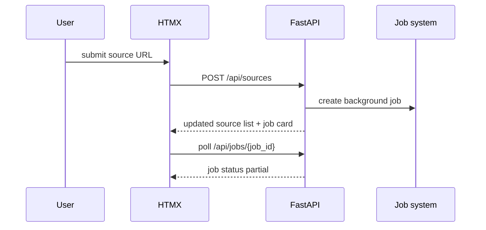

# Web Frontend

The frontend is a server-rendered FastAPI app using:

- Jinja2 templates
- HTMX for progressive interactivity
- Tailwind-based styling from static assets / CDN-friendly patterns

There is no SPA framework. Most behavior is HTML-first with HTMX swaps.

## Route map

### Page routes

Implemented primarily in `src/web/app.py` plus feature routers:

- `/` — dashboard
- `/events` — searchable/filterable event list
- `/event/{event_id}` — event detail
- `/calendar` and `/calendars` — calendar views
- `/calendar.ics` — ICS feed
- `/weekend` — ranked weekend recommendations
- `/jobs` — job history
- `/login`
- `/signup`
- `/profile`
- `/sources`
- `/source/{source_id}`

### Action/API routes

- `/api/scrape`
- `/api/tag`
- `/api/tag/stale`
- `/api/dedupe`
- `/api/notify`
- `/api/attend/{event_id}`
- `/api/unattend/{event_id}`
- `/api/unattend-bulk`
- `/api/unattend-bulk/undo/{undo_token}`
- `/api/jobs/{job_id}`
- `/api/jobs/{job_id}/cancel`
- `/api/profile/...`
- `/api/sources...`
- `/health`

## Page behavior

## Dashboard

The dashboard aggregates:

- event totals
- tagged / untagged counts
- stale-tagged count
- recent pipeline timestamps
- top toddler-friendly events
- category slices like arts/outdoor/nature
- recent background jobs

## Events page

`/events` supports server-side filtering via the DB layer.

Current filters/sorts exposed by the route:

- `q`
- `city`
- `source`
- `tagged`
- `attended`
- `score_min`
- `sort`
- `page`

Results are paginated at 25 per page.

The route returns a partial only when the HTMX target is `events-results`.

## Event detail

The event detail page shows:

- normalized event fields
- tag grid
- raw JSON payload
- attendance controls

## Weekend page

The weekend page renders ranked recommendations using the current user profile
plus weather-aware ranking.

## Calendar

The app includes both HTML calendar views and an ICS endpoint:

- `/calendar`
- `/calendars`
- `/calendar.ics`

## Sources UI

The sources experience is now a first-class feature.

Users can:

- view predefined sources
- add catalog sources
- add custom URLs
- trigger source analysis jobs
- re-analyze custom sources
- test recipe-driven sources
- enable/disable or delete sources

## Auth/profile UI

Authentication and profile settings are fully part of the web surface:

- signup with onboarding fields
- login/logout
- profile editing
- notification preferences
- password change
- theme switching

## HTMX patterns

Common patterns used across the app:

- partial rendering for tables/cards
- optimistic-feeling action buttons with loading indicators
- in-place replacement of status blocks
- background job polling
- toast-style feedback responses

```mermaid
sequenceDiagram
    participant U as User
    participant H as HTMX
    participant W as FastAPI
    participant J as Job system

    U->>H: submit source URL
    H->>W: POST /api/sources
    W->>J: create background job
    W-->>H: updated source list + job card
    H->>W: poll /api/jobs/{job_id}
    W-->>H: job status partial
```

## Templates

Top-level templates include:

- `base.html`
- `dashboard.html`
- `events.html`
- `event_detail.html`
- `calendar.html`
- `weekend.html`
- `jobs.html`
- `login.html`
- `signup.html`
- `profile.html`
- `sources.html`
- `source_detail.html`
- `404.html`
- `500.html`

Key partials include:

- `_events_table.html`
- `_event_row.html`
- `_event_card.html`
- `_tags_grid.html`
- `_notification.html`
- `_job_status.html`
- `_profile_status.html`
- `_source_card.html`
- `_source_test_results.html`
- `_calendar_grid.html`
- `_calendar_shell.html`
- skeleton partials for loading states

## Middleware and request handling

The app uses:

- `RequestLoggingMiddleware`
- `SessionMiddleware`

Session/cookie behavior is driven by config such as:

- `SESSION_SECRET`
- `SESSION_COOKIE_SECURE`
- `SESSION_COOKIE_SAME_SITE`
- `SESSION_COOKIE_DOMAIN`
- `SESSION_MAX_AGE_SECONDS`

CSRF protection is enforced on state-changing authenticated routes.

## Health endpoint

`/health` returns service status and DB-derived stats:

- `status`
- database ok flag
- `event_count`
- `latest_scraped_at`

## Frontend implementation notes

- The UI is mostly HTML+HTMX, but the repo does include `package.json` and CSS assets.
- The docs should not describe the frontend as only four pages anymore.
- Background job UX is now an important part of the product surface.
- Sources management and onboarding/profile flows are part of the real app, not future design work.
