# Web Frontend

The web UI is server-rendered HTML using **Jinja2** templates, **HTMX** for interactivity,
and **Tailwind CSS** (CDN) for styling. There is zero custom JavaScript in the project.

## Stack

| Technology | Role | Loaded via |
|------------|------|------------|
| Jinja2 | Template engine with inheritance | FastAPI built-in |
| HTMX 2.0.4 | Declarative AJAX (search, pagination, actions) | CDN `<script>` |
| Tailwind CSS | Utility-first CSS | CDN play script |

No npm, no bundler, no build step. The entire frontend is HTML with `hx-*` attributes.

## Template Hierarchy


## HTMX Interaction Map

Every interactive element uses HTMX attributes instead of JavaScript.

```mermaid
sequenceDiagram
    participant U as User
    participant B as Browser (HTMX)
    participant S as Server (FastAPI)

    Note over U,S: Events Page - Search
    U->>B: Types in search box
    B->>B: 300ms debounce (hx-trigger)
    B->>S: GET /events?q=kids&page=1
    Note over S: Detects HX-Request header
    S->>B: Returns _events_table.html partial only
    B->>B: Swaps #events-results innerHTML
    B->>B: Updates URL bar (hx-push-url)

    Note over U,S: Events Page - Filter Change
    U->>B: Changes city dropdown
    B->>S: GET /events?city=Lafayette&page=1
    B->>B: Shows skeleton overlay (.htmx-request)
    S->>B: Returns _events_table.html partial
    B->>B: Swaps content, hides skeleton

    Note over U,S: Dashboard - Run Scrapers
    U->>B: Clicks "Run Scrapers"
    B->>B: Disables button (hx-disabled-elt)
    B->>B: Shows spinner (hx-indicator)
    B->>S: POST /api/scrape
    S->>S: Runs all 5 scrapers
    S->>B: HTML snippet: "Scraped 42 events ✅"
    B->>B: Swaps #action-status innerHTML
    B->>B: Re-enables button, hides spinner

    Note over U,S: Event Detail - Mark Attended
    U->>B: Clicks "Mark Attended"
    B->>B: Shows spinner on button
    B->>S: POST /api/attend/{id}
    S->>B: HTML: "Attended ✅" label
    B->>B: Replaces button with label (outerHTML)
```



## HTMX Patterns Used

### 1. Partial Page Rendering

The `/events` route detects HTMX requests via the `HX-Request` header and returns
only the table partial instead of the full page:

```python
# src/web/app.py
if request.headers.get("HX-Request"):
    return templates.TemplateResponse("partials/_events_table.html", ctx)
return templates.TemplateResponse("events.html", ctx)
```

This means the same URL works for both:
- **Full page load** (browser navigation) → full HTML with `<html>`, nav, etc.
- **HTMX request** (search/filter/pagination) → just the table + pagination fragment

### 2. Debounced Search

```html
<input
    hx-get="/events"
    hx-target="#events-results"
    hx-trigger="keyup changed delay:300ms"
    hx-include="#events-form"
    hx-push-url="true"
/>
```

- `keyup changed` — only fires when value actually changes
- `delay:300ms` — debounces to avoid hammering the server
- `hx-include` — sends all form fields (filters, sort, page) with the request
- `hx-push-url` — updates browser URL for bookmarkability

### 3. Auto-Submit Filters

```html
<select name="city" class="auto-submit">
```

The form has `hx-trigger="submit, change from:.auto-submit"`, so changing any
filter dropdown immediately fires a new request.

### 4. Button Loading States

```html
<button
    hx-post="/api/scrape"
    hx-target="#action-status"
    hx-indicator="this"
    hx-disabled-elt="this"
>
    🔄 Run Scrapers
    <span class="htmx-indicator"><span class="spinner"></span></span>
</button>
```

- `hx-indicator="this"` — adds `.htmx-request` to the button itself
- `hx-disabled-elt="this"` — sets `disabled` during the request
- The spinner is hidden by default, shown when `.htmx-request` is on parent

### 5. In-Place Element Swap

```html
<button
    hx-post="/api/attend/{id}"
    hx-target="#attend-btn"
    hx-swap="outerHTML"
>
```

The server returns a static label that replaces the button entirely.

## Skeleton Loading System

Loading states are CSS-only, triggered by HTMX's built-in `.htmx-request` class.


### CSS Animations

| Animation | Element | Duration | CSS |
|-----------|---------|----------|-----|
| Shimmer | `.skeleton` | 1.4s loop | `background-position` sweep |
| Spinner | `.spinner` | 0.6s loop | `border-top` rotation |
| Progress bar | `#global-progress .bar` | 1.0s loop | `translateX` slide |
| Overlay fade | `.skeleton-overlay` | 150ms | `opacity` transition |

### Skeleton Overlay Pattern

The events table uses an absolutely-positioned overlay that sits on top of the content:

```html
<div id="events-results-wrapper" class="relative">
    <!-- Skeleton: hidden by default (opacity: 0) -->
    <div class="skeleton-overlay">
        
    </div>
    <!-- Real content -->
    <div id="events-results">
        
    </div>
</div>
```

When HTMX adds `.htmx-request` to the wrapper (via `hx-indicator`),
CSS transitions the overlay to `opacity: 1`, showing shimmer rows.
When the response arrives and content is swapped, the class is removed
and the overlay fades out.

## Page Data Requirements

| Page | Route | Template Data |
|------|-------|---------------|
| Dashboard | `GET /` | `total`, `tagged`, `untagged`, `sources`, `top_events` (5 events) |
| Events | `GET /events` | `events`, `total`, `page`, `per_page`, `total_pages`, `q`, `city`, `source`, `tagged`, `score_min`, `sort`, `cities`, `sources` |
| Event Detail | `GET /event/{id}` | `event`, `raw_data` (JSON string) |
| Weekend | `GET /weekend` | `saturday`, `sunday`, `weather`, `ranked` (event+score tuples), `message` |

## Design System

The UI uses Tailwind utility classes following a consistent design language:

| Element | Classes |
|---------|---------|
| Card | `bg-white rounded-xl p-5 mb-4 shadow-sm` |
| Badge (green) | `inline-block px-2 py-0.5 rounded-full text-xs font-semibold bg-green-100 text-green-800` |
| Badge (orange) | `...bg-orange-100 text-orange-800` |
| Badge (gray) | `...bg-gray-100 text-gray-700` |
| Primary button | `bg-indigo-500 hover:bg-indigo-600 text-white px-4 py-2 rounded-lg font-semibold text-sm` |
| Score number | `text-3xl font-bold text-indigo-500` |
| Header | `bg-gradient-to-r from-indigo-500 to-purple-500` |
