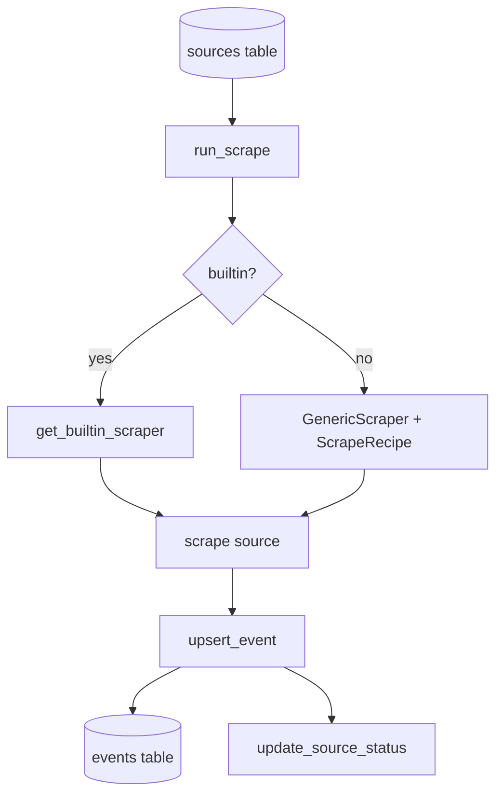
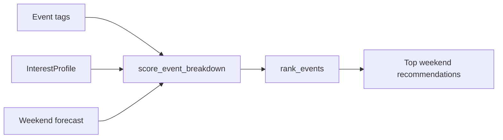

# Scraping, Tagging, Ranking, and Notifications

This document describes the actual runtime pipeline in the repository as of the
Postgres-native local/dev migration.

## Pipeline summary

```text
scrape -> tag -> notify
```

Ranking happens inside `run_notify()` when weekend recommendations are built.
There is no working standalone `run_full_pipeline()` implementation right now,
even though the CLI still exposes a `pipeline` command.

## Orchestration entry points

### CLI

```bash
uv run python -m src.main scrape
uv run python -m src.main tag
uv run python -m src.main notify
uv run python -m src.main events
uv run python -m src.main serve
uv run python -m src.main dedupe
```

### Scheduler

```bash
uv run python -m src.cron
```

Scheduled jobs in `src/cron.py`:

- daily scrape + tag
- Friday notifications for each user

## Stage 1: Scraping

`src/scheduler.py::run_scrape()` loads **all stored sources** from the database
and iterates over enabled ones.

Source types:

- predefined built-in sources (`builtin=True`)
- custom recipe-driven sources (`builtin=False`, `recipe_json` required)


```mermaid
flowchart TD
    DB[(sources table)] --> LOAD[run_scrape]
    LOAD --> BUILTIN{builtin?}
    BUILTIN -->|yes| ROUTER[get_builtin_scraper]
    BUILTIN -->|no| GENERIC[GenericScraper + ScrapeRecipe]
    ROUTER --> SCRAPE[scrape source]
    GENERIC --> SCRAPE
    SCRAPE --> UPSERT[upsert_event]
    UPSERT --> EVENTS[(events table)]
    UPSERT --> STATUS[update_source_status]
```

### Built-in scrapers

Current built-in routing domains:

- `brec.org`
- `eventbrite.com`
- `allevents.in`
- `moncuspark.org`
- `acadianacenterforthearts.org`
- `lafayettesciencemuseum.org`
- `lafayettela.libcal.com`
- `ebrpl.libcal.com`

### Generic/custom scraper flow

Custom sources are analyzed once, saved as a `ScrapeRecipe`, then replayed by
`GenericScraper`.

- `jsonld` strategy: parse schema.org Event blocks
- `css` strategy: replay selectors over repeating event containers

### Source status lifecycle

Source rows can move through statuses such as:

- `pending`
- `analyzing`
- `active`
- `stale`
- `failed`
- `disabled`

`run_scrape()` updates source metadata after each run, including:

- `last_scraped_at`
- `last_event_count`
- `last_error`

## Event upsert and dedupe

Events are always upserted through the DB layer.

Primary dedupe:

- unique key on `(source, source_id)`

Additional cross-source dedupe:

- title/date/city fingerprint matching
- fuzzy title similarity around the same time window

This dedupe behavior exists in both backends:

- `src/db/database.py` for SQLite
- `src/db/postgres.py` for Postgres

There is also a CLI/web-accessible backfill dedupe operation:

```bash
uv run python -m src.main dedupe
```

## Stage 2: Tagging

`src/scheduler.py::run_tag()` fetches events via:

- untagged events
- optionally stale-tagged events when `tagging_version` changes

Tagging version comes from:

- `src/tagger/taxonomy.py`

### Tagger behavior

`EventTagger` chooses between:

- OpenAI tagging when `OPENAI_API_KEY` is configured
- heuristic tagging otherwise

Config knobs in `src/config.py`:

- `OPENAI_MODEL`
- `OPENAI_TIMEOUT_SECONDS`
- `OPENAI_MAX_RETRIES`
- `TAGGER_CONCURRENCY`
- `TAGGER_BATCH_SIZE`

For each successful tagged event, the pipeline writes:

- `tags`
- `tagged_at`
- `score_breakdown`

## EventTags shape

The tag payload is richer than the original docs implied. It includes fields such as:

- `tagging_version`
- `toddler_score`
- `indoor_outdoor`
- `noise_level`
- `crowd_level`
- `energy_level`
- `stroller_friendly`
- `parking_available`
- `bathroom_accessible`
- `food_available`
- `nap_compatible`
- `weather_dependent`
- `good_for_rain`
- `good_for_heat`
- `confidence_score`
- `parent_attention_required`
- `meltdown_risk`
- `audience`
- `positive_signals`
- `caution_signals`
- `exclusion_signals`
- `raw_rule_score`

## Stage 3: Ranking

Ranking is done by `src/ranker/scoring.py` during notification generation and
some UI rendering.

Current weighted components:

- toddler fit (`2.2`)
- intrinsic/rule score (`0.35`)
- interest match (`1.4`)
- weather (`1.0`)
- timing (`1.0`)
- logistics (`0.9`)
- novelty (`0.4`)
- city (`0.8`)
- confidence (`0.5`)
- minus budget penalty
- minus rule penalty

The implementation is centered on:

- `score_event_breakdown(...)`
- `score_event(...)`
- `rank_events(...)`


```mermaid
flowchart LR
    TAGS[Event tags] --> SCORE[score_event_breakdown]
    PROFILE[InterestProfile] --> SCORE
    WEATHER[Weekend forecast] --> SCORE
    SCORE --> RANK[rank_events]
    RANK --> TOP[Top weekend recommendations]
```

## Stage 4: Notification

`run_notify()`:

1. selects the target weekend
2. fetches weather
3. loads weekend events
4. expands with nearby upcoming events when the weekend pool is too small
5. filters to tagged events
6. ranks them
7. formats a message
8. dispatches by user-configured channels

Dispatcher implementation:

- `console`
- `sms`
- `telegram`
- `email`

Recipients are now primarily per-user:

- `user.email_to`
- `user.sms_to`
- `user.notification_channels`
- `user.child_name`

## Data storage notes

### Postgres

The intended runtime backend is now Postgres.

Important event storage choices:

- `tags` as `JSONB`
- `score_breakdown` as `JSONB`
- trigram indexes on `lower(title)` and `lower(description)`
- expression indexes on `tags->>'tagging_version'` and toddler score

### SQLite

SQLite remains available for compatibility/tests, but docs and local dev should
assume Postgres unless explicitly stated otherwise.

## Operational caveats

- `src.main pipeline` is still broken because `run_full_pipeline()` does not exist.
- Search behavior has had backend/schema fixes, but still deserves manual smoke testing.
- Library scraping remains the most fragile source family.
