# Scraping & Tagging Pipeline

This document explains how events flow from external websites into the database,
get tagged by AI, scored, ranked, and turned into notifications.

## Pipeline Overview


## Stage 1: Scraping

### How Each Scraper Works

#### BREC (Baton Rouge parks)


- Scrapes current month and next month
- Parses park names from event titles and location fields
- Generates `source_id` from title + date for dedup
- ~1,400 events per scrape (most are recurring programs)

#### Eventbrite


- Tries 3 parsing strategies in order: JSON-LD → server data → HTML
- Scrapes for both Lafayette and Baton Rouge
- Uses Eventbrite's native event IDs for dedup

#### AllEvents.in


- Scrapes family/kids category pages for both cities
- JSON-LD preferred, falls back to HTML card parsing

#### Lafayette Venues


- Three WordPress sites using Modern Events Calendar (MEC) plugin:
  - Moncus Park
  - Acadiana Center for the Arts
  - Lafayette Science Museum
- MEC exposes a JSON API endpoint for calendar data

#### Libraries

- Attempts LibCal RSS feeds for Lafayette and East Baton Rouge
- Falls back to HTML parsing
- Some library calendars require JavaScript rendering (Playwright needed)

### Deduplication

Events are deduplicated on `UNIQUE(source, source_id)`:

```sql
INSERT INTO events (...) VALUES (...)
ON CONFLICT(source, source_id) DO UPDATE SET
    title = excluded.title,
    description = excluded.description,
    start_time = excluded.start_time,
    ...
```

This means:
- Re-scraping the same source updates existing events (new times, descriptions)
- Tags and attended status are preserved across re-scrapes
- Different sources can have the same event (not yet cross-source deduped)

## Stage 2: AI Tagging


### OpenAI Tagging (Primary)

Sends event title + description to `gpt-4o-mini` with a structured output prompt:

```
You are an expert at evaluating events for toddler-friendliness.
Rate this event on these dimensions:
- toddler_score (0-10)
- indoor_outdoor (indoor/outdoor/both)
- noise_level, crowd_level, energy_level
- stroller_friendly, parking_available, ...
- categories (list of tags)
- meltdown_risk (low/medium/high)
Return valid JSON matching the EventTags schema.
```

Cost: ~$0.001 per event (gpt-4o-mini pricing).

### Heuristic Tagging (Fallback)

When no OpenAI key is configured, uses keyword matching:

```python
# Example heuristic rules
if any(w in title_lower for w in ["kids", "children", "toddler", "youth"]):
    score += 3
if any(w in title_lower for w in ["playground", "splash", "play"]):
    score += 2
if any(w in title_lower for w in ["beer", "wine", "cocktail", "21+"]):
    score -= 5
```

Categories are assigned by keyword detection ("art" → arts, "animal" → animals, etc.).
Heuristic tags have `confidence_score = 0.5` vs LLM's `0.8+`.

## Stage 3: Ranking

The ranker takes tagged events and produces a sorted list with scores.


### Scoring Details

#### Toddler Score (×3.0)
Direct from AI tags. A "Kids at Play" event scores 8-10, a "Beer Festival" scores 0-1.

#### Interest Match (×2.5)
Compares event `categories` against the child's profile:
- Each category in `loves` → +2 points
- Each category in `likes` → +1 point
- Each category in `dislikes` → -2 points

#### Weather Compatibility (×2.0)
- Rainy forecast + indoor event = +10
- Rainy forecast + outdoor event = -5
- Hot forecast (>90°F) + water play = +5
- Hot forecast + outdoor non-water = -3

#### City Proximity (×2.0)
- Lafayette (home city) = +10
- Baton Rouge = +2
- Other = -5

#### Timing (×1.5)
- Morning (8-11am) = +5 (toddler peak energy)
- During nap (1-3pm) = -8
- After bedtime (7:30pm+) = -10
- Afternoon (3-5pm) = +2

#### Logistics (×1.0)
- Stroller-friendly = +3
- Parking available = +2
- Bathrooms accessible = +2
- Low meltdown risk = +3

#### Novelty (×0.5)
- Not previously attended = +5
- Already attended = 0

## Stage 4: Notification


Channels are configured via `NOTIFICATION_CHANNELS` env var (JSON array).
Default is `["console"]` (stdout only).

## Scheduling

```mermaid
gantt
    title Weekly Schedule
    dateFormat HH:mm
    axisFormat %H:%M

    section Daily (Mon-Sun)
    Scrape all sources   :crit, 02:00, 30min
    Tag new events       :02:30, 15min

    section Friday
    Scrape all sources   :crit, 02:00, 30min
    Tag new events       :02:30, 15min
    Rank + Notify        :active, 08:00, 5min
```



The cron scheduler (`src/cron.py`) runs as a separate systemd service:
- **Daily at 2:00 AM** — Scrape all sources + tag new events
- **Friday at 8:00 AM** — Rank weekend events + send notification

## Error Handling

- Each scraper runs independently; one failure doesn't block others
- HTTP errors are caught and logged, scraper returns empty list
- OpenAI failures fall back to heuristic tagging
- Weather API failures use default Louisiana forecast (85°F, partly cloudy)
- Database uses WAL mode for concurrent read/write safety
